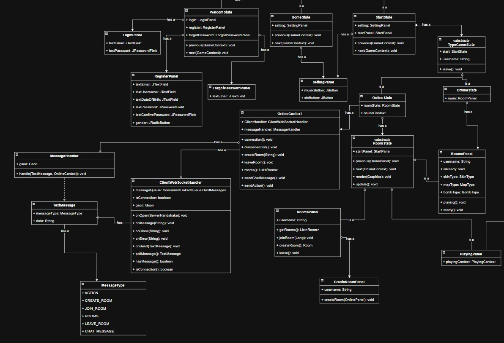

= Low Level Design
Long Nguyen Hoang <nghlong3004@gmail.com>
v2.0, 2025-12
:sectnums:
:toc:
:toclevels: 4
:source-highlighter: highlight.js

'''

[small]
====
Author: {author} +
Email: {email} +

Version: {revnumber} ({revdate})
====

== Class Diagram

image::images/class-diagram.jpg[]

=== Main

image::images/main-class-diagram.jpg[]

=== Body

=== Entities

image::images/entities-class-diagram.jpg[]

=== Playing

image::images/playing-start-diagram.jpg[]

== Design Patterns Mapping

=== Command Pattern

* *Mục đích*: Quản lý luồng chuyển đổi màn hình và trạng thái của trò chơi, giúp code không bị phụ thuộc vào quá nhiều câu lệnh if-else khi chuyển cảnh

* *Mô tả hành vi*: Khi người dùng ở màn hình StartState và chọn chế độ Online, StartState sẽ gọi next(context), GameContext sẽ chuyển trạng thái hiện tại sang RoomState

=== Strategy Pattern
* *Mục đích*: Đóng gói các thuật toán xử lý khác nhau và cho phép thay đổi hành vi của đối tượng tại thời điểm chạy (runtime).

* *Mô tả hành vi*: Sử dụng cho hệ thống AI của quái, cho phép thay đổi linh hoạt giữa các chiến thuật: Đi ngẫu nhiên, Đuổi theo người chơi, hoặc Đứng yên

=== State Pattern
* *Mục đích*: Chuyển đổi một yêu cầu thành một đối tượng độc lập, giúp tham số hóa các yêu cầu người dùng (như nhật ký hoạt động, hàng đợi).

* *Mô tả hành vi*: Khi người chơi bấm phím làm ra 1 action, KeyboardInput không thực thi logic ngay mà đóng gói yêu cầu đó thành một thông điệp (Message) thông qua MessageType.ACTION để gửi lên Server hoặc đưa vào hàng đợi xử lý của PlayingContext

=== Factory Pattern
* *Mục đích*: Cung cấp một giao diện để tạo ra các đối tượng mà không để lộ logic tạo mới đối tượng cho phía người dùng.

* *Mô tả hành vi*: FactoryManager chịu trách nhiệm khởi tạo và cung cấp danh sách các quản lý thực thể (BomberManager, BombManager, ItemManager) cho PlayingContext khi game bắt đầu, giúp tách biệt logic khởi tạo khỏi logic vận hành game.

=== Observer Pattern
* *Mục đích*: Định nghĩa mối quan hệ phụ thuộc một-nhiều giữa các đối tượng để khi một đối tượng thay đổi trạng thái, tất cả các thành phần phụ thuộc nó sẽ được thông báo và cập nhật tự động.

* *Mô tả hành vi*: GameLoop chạy liên tục và gọi update()/repaint() trên GamePanel. Tương tự, khi ClientWebSocketHandler nhận gói tin từ Server, nó thông báo cho hệ thống để cập nhật vị trí nhân vật mà không cần các lớp này gọi lẫn nhau trực tiếp.

=== Template Method Pattern
* *Mục đích*: Định nghĩa khung của một thuật toán trong lớp cha, để lớp con thực hiện các bước cụ thể mà không thay đổi cấu trúc thuật toán.

* *Mô tả hành vi*: StartPanel cung cấp khung sườn chung cho giao diện bắt đầu, trong khi OnlinePanel cài đặt thêm logic kết nối mạng (RoomState), còn OfflinePanel cài đặt logic chơi đơn (RoomPanel).